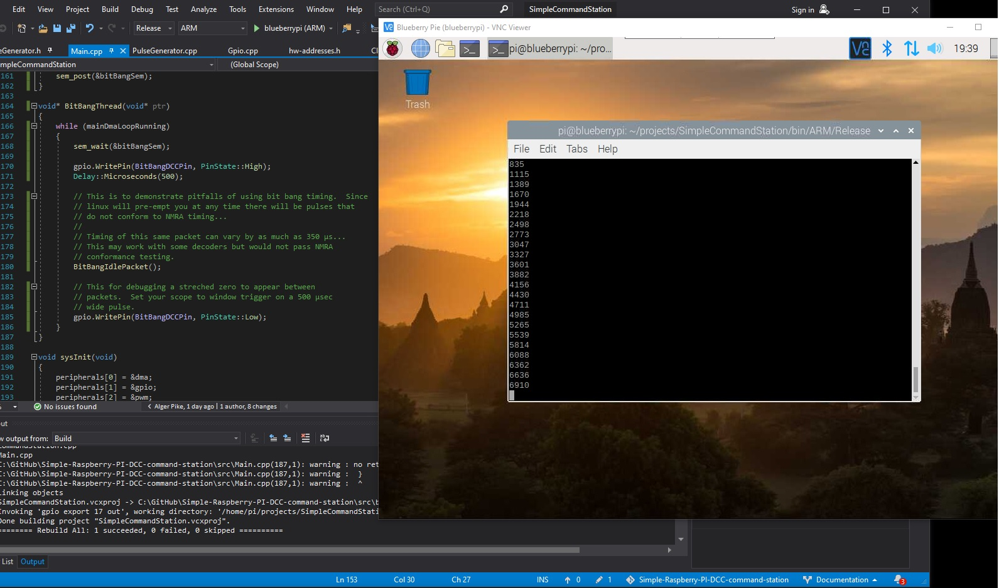
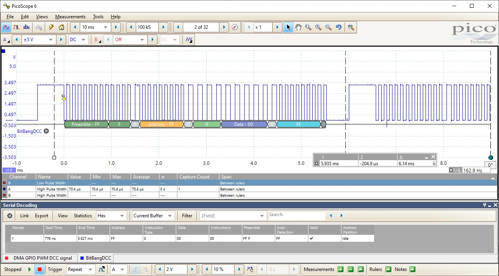
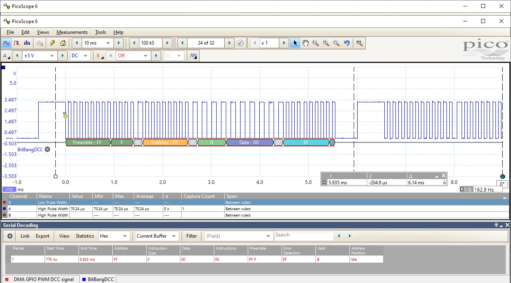
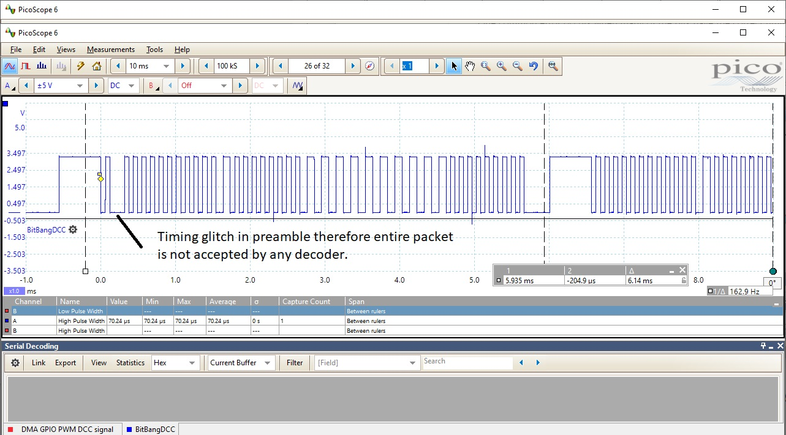
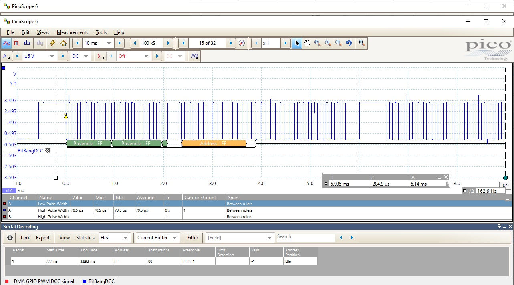

# Simple-Raspberry-PI-DCC-command-station.
The intent of this project is to explore two different ways of generating a national model railroad association (NMRA) digital command control (DCC) signal using a raspberry pi model 3B.  The two methods explored here are a direct GPIO bit-bang approach using CPU, and a second approach which uses the direct memory access (DMA), pulse width modulation (PWM), and general purpose  input output (GPIO) peripherals on the raspberry pi to generate the DCC signal without using CPU resources.  An oscilloscpe trace showing the two methods is shown below:


In the image above, the VNC viewer application is displaying the target Raspberry PI 3, which is running the command station program.  In the upper right-hand corner can be seen the CPU resources required to run this application.  Most of the resources currently are associated with the bit-bang thread which is generating one of the two DCC signals. The command station program is running in the open linux console with the incrementing digits.  These scrolling digits represent the number of DCC Idle packets that the DMAPWM timer has generated. (Currently this simple command station only generates idle
packets...)

Outputs from the two DCC signal generation methods are each directed to its own GPIO pin on the raspberry PI.  These pins are both configured as outputs.  The bit-bang DCC signal is forwarded to GPIO pin 21 and the DMAPWM DCC signal is forwarded to GPIO pin 5. For debugging and oscilloscpe triggering purposes, a streched 500 µsec zero bit is placed in between each idle DCC packet that is generated.  This is useful to be able to see the start and end of each DCC idle packet.

Each GPIO pin (21 and 5), has been connected to a channel of an oscilloscope for timing comparison.  The scope is triggered on a 400 µsec window after a rising edge. This allows synching of the DCC signals by using the streched zero bit mentioned 
previously.  Each channel is labelled.  Pin 21 which is the bit-bang GPIO DCC signal is displayed in channel A.  Pin 5 which is the DMA PWM timed signal is displayed in channel B.  Relative timing differences between the two methods can clearly be seen.

For peripeheral access and control this program uses the APIPIe peripheral libray written in C++ specifically for this purpose.  This library handles all of the timing, GPIO access, DMA control and PWM function required to make these techniques function.
More information on this libray can be found at the link below:

https://github.com/AlgerP572/APLPIe

### DCC signal via GPIO bit-bang

The first approach being explored to generate a DCC idle packet is a simple bit bang approach that uses the ARM/CPU core to handle all of the timing and GPIO pin control.  This appraoch has the advantage of being very simple to program in C/C++ code and can be handled by inserting delays with the required pulse widths in between the GPIO pin write instructions.  C code that generates a DCC idle packet is shown below:

```C++

void BitBangIdlePacket()
{
	// using 98 µsec instead of 100 to force
	// zero packets to use Microsecond spin and
	// avoid the overhead with calling the system
	// time APIs. See Delay::Microseconds for details
	// Ans also accomodating for overhead in MicroSecondSpin
	// so specifying 2 µsec less than target.

	for (int i = 0; i < 12; i++)
	{
		gpio.WritePin(BitBangDCCPin, PinState::Low);
		Delay::Microseconds(58);
		gpio.WritePin(BitBangDCCPin, PinState::High);
		Delay::Microseconds(58);
	}

	// Byte end bit
	gpio.WritePin(BitBangDCCPin, PinState::Low);
	Delay::Microseconds(98);
	gpio.WritePin(BitBangDCCPin, PinState::High);
	Delay::Microseconds(98);

	// Byte: Value = 0xFF (255)
	for (int i = 0; i < 8; i++)
	{
		gpio.WritePin(BitBangDCCPin, PinState::Low);
		Delay::Microseconds(58);
		gpio.WritePin(BitBangDCCPin, PinState::High);
		Delay::Microseconds(58);
	}

	// Byte end bit
	gpio.WritePin(BitBangDCCPin, PinState::Low);
	Delay::Microseconds(98);
	gpio.WritePin(BitBangDCCPin, PinState::High);
	Delay::Microseconds(98);

	// Byte: Value = 0x00 (0)
	for (int i = 0; i < 8; i++)
	{
		gpio.WritePin(BitBangDCCPin, PinState::Low);
		Delay::Microseconds(98);
		gpio.WritePin(BitBangDCCPin, PinState::High);
		Delay::Microseconds(98);
	}

	// Byte end bit
	gpio.WritePin(BitBangDCCPin, PinState::Low);
	Delay::Microseconds(98);
	gpio.WritePin(BitBangDCCPin, PinState::High);
	Delay::Microseconds(98);

	// Checksum Byte: Value = 0xFF (255)
	for (int i = 0; i < 8; i++)
	{
		gpio.WritePin(BitBangDCCPin, PinState::Low);
		Delay::Microseconds(58);
		gpio.WritePin(BitBangDCCPin, PinState::High);
		Delay::Microseconds(58);
	}

	// Packet end bit.
	gpio.WritePin(BitBangDCCPin, PinState::Low);
	Delay::Microseconds(58);
	gpio.WritePin(BitBangDCCPin, PinState::High);
	Delay::Microseconds(58);
}

```

As with most pre-emptive task operating systems, such as Windows 10, or OS/2, linux should on average be very capable and hopefully fast enough to generate any one single DCC idle packet. Questions arise however regarding sustained accuracy of this timing. Can sustained performance be mantained when the command station application becomes more complete, and the applcation is asked to take on other tasks at the same time, such as display feedback, multiple throttles, and other advanced command station functions.  Will linux be able to sustain NMRA timing requirements while meeting these other application functions?

To answer this question a simple test app is provided that creates two basic threads.  One thread simply creates the idle packet and repeats the the packet on an I/O pin to create a stream of DCC idle packets.  A second thread prints to the screen the number of DCC packets that have so far been generated.  This simulates additional status functionality that a more advanced command station package might provide and gives the bit-bang thread a second thread which will also compete for CPU resources. A screen shot of the application is shown below:



Measuring the performance of this CPU only based DCC approach can be achieved by attaching the input channel of an oscilloscope, to the output DCC pin on the raspberry PI that has been configured for this purpose.  To make triggering easier for visual synching purposes a streched zero bit of 500 µsec length has been placed inbetween each valid idle packet as they are generated:

```C++

void* BitBangThread(void* ptr)
{
	while (mainDmaLoopRunning)
	{
		sem_wait(&bitBangSem);

		gpio.WritePin(BitBangDCCPin, PinState::High);
		Delay::Microseconds(500);

		// This is to demonstrate pitfalls of using bit bang timing.  Since
		// linux will pre-empt you at any time there will be pulses that 
		// do not conform to NMRA timing...
		//
		// Timing of this same packet can vary by as much as 350 µs...
		// This may work with some decoders but would not pass NMRA
		// conformance testing.
		BitBangIdlePacket();

		// This for debugging a streched zero to appear between
		// packets.  Set your scope to window trigger on a 500 µsec
		// wide pulse.
		gpio.WritePin(BitBangDCCPin, PinState::Low);
	}
}

```

A scope trace of the typical average packet that does meet NMRA timing specifications is shown below:



Most of the packets generated by this approach do indeed look correct and will meet the NMRA timing specification.  However there are packets the will fall out of the specification. When this does occur what types of errors can observed?  Most of the errors will likely be associated with the Linux thread scheduling algorithm as it schedules other threads in the same application, other applications or the operating system.  Some tuning can be achieved by changing the priority of the bit-bang thread but care must be taken not to starve other threads in the same application particularly if they may be scheduling the next packet to run..

#### Bit-Timing Error

One common error occurs when many of the bits have the correct timing but some do not.  In this case the packet will be invalid and the checksum should be able to detect this.  Below is an example where the bit that does not meet specification is actually in the check sum byte (an 0xEF is sent instead of oxFF and decoders should ignore this packet):



#### Preamble glitch

Here is another example of a bit timing error.  This timing the bit error is in the preamble and is more pronounced than the previous example.  Decoders should not detect this packet due to the malformed preamble:



### Multiple bit errors

A final example shows multiple timing errors in the same packet.



Overall success!  The raspberry PI does seem to be able to generate valid NMRA DCC packets at least on average with the Bit-Bang GPIO approach.  I have not tried to control any trains yet via this technique and I have also not measured what percentage of packets conform to the specifications.  It may well be that this appraoch is perfectly acceptable for driving trains on the railroad.  However, I also noticed the raspberry PI has several timing peripherals with timing specs that should easily conform to the NMRA standard.  Can these be used to generate a valid stream of DCC pakets?

### DCC signal via PWM gated DMA transfers from memory to GPIO

In the previous section using a simple bit-bang CPU driven approach was used to generate a DCC signal.  During the coding of the method it became clear that this approach will use about 36 per cent of the CPU and needs to be continuous and high priority.  This leaves limited resources for the program to do other things like display status query throttles queue packets etc.  It was already also seen that even without this overhead there are times when glitches can occur due to the fact that the CPU is also keeping linux up and running at the same time.

I then began to wonder if the peripherls on the PI could be used to generate a DCC signal that would not use as many CPU resources and or use them in a way that was not so timing critical.  After many hours of research I thought I might be able to try an approach that uses DMA to move the required pin state onto the GPIO pins directly from memory.  If this could be done then perhaps a predefined sequence could be setup and triggered by the CPU.  And then once this triggering was set, in theory no further CPU resources would be required, since the DMA transactions can occur without any CPU overhead. Shown below is an image of this setup generating DCC Idle packets:


More to come!


