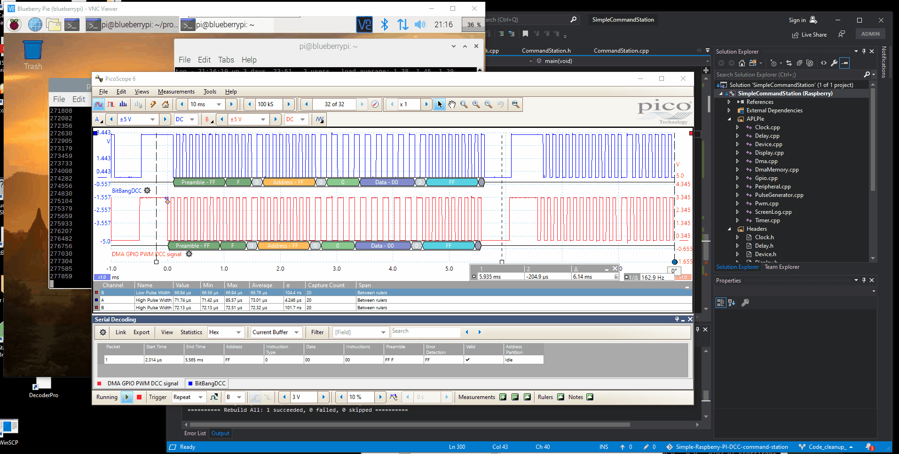

# Simple-Raspberry-PI-DCC-command-station.
The intent of this project is to explore two different ways of generating a national
model railroad association (NMRA) digital command control (DCC) signal using a 
raspberry pi model 3B.  The two methods explored here are a direct GPIO bit-bang
approach using CPU, and a second approach which uses the direct memory access (DMA),
pulse width modulation (PWM), and general purpose input output (GPIO) peripherals
on the raspberry pi to generate the DCC signal without using CPU resources.  An
oscilloscpe trace showing the two methods is shown below:

The VNC viewer application is displaying the target Raspberry PI 3 which is running
the command station program.  In the right hand corner can be seen the CPU resources
required to run this application.  Most of the resources currently are associated with
the bit-bang thread which is generating one of the two DCC signals.  The command station
program is running in the open linux console with the incrementing digits.  These scrolling
digits represent the number of DCC Idle packets that the DMAPWM timer has generated.
(Currently this simple command station only generates idle packets...)

Outputs from the two DCC signal generation methods are directed to a GPIO pin on the PI configured
as an output.  The bit-bang DCC signal is forwarded to GPIO pin 21 and the DMAPWM DCC signal
is forwarded to GPIO pin 5.  For debugging oscilloscpe triggering purposes a streched 500 µsec
zero bit is placed in between each idle DCC packet that is generated.  This is useful to 
be able to see the transitions between the idle DCC packets.

Each GPIO pins 21 and 5, which each have a DCC signal output have been connected to two channels
of an oscilloscope for timing comparison.  The scope is triggered on a 400 µsec window after a
rising edge.  This allows synching of the DCC signals by using the streched zero bit mentioned
previously.  Each channel is labelled.  Pin 21 which is the bit-bang GPIO DCC signal is displayed
in channel A.  Pin 5 which is the DMA PWM timed signal is displayed in channel B.  Relative timing
differences between the two methods can clearly be seen.

